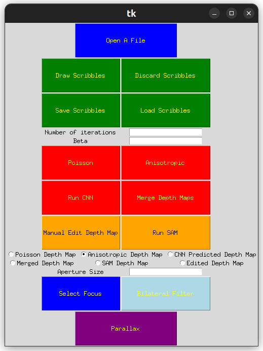

# Student Workspace for CS4365 Applied Image Processing
### Roberto Gheda - 5863503
## Build and run
Build the C++ executables
```
mkdir -p build && cd build/ && cmake .. && make && cd ..
```
Then create and activate a python environment 
```
python3 -m venv env && source env/bin/activate
```
Install python requirements
```
python3 -m pip install -r requirements.txt
```
Download DistDepth CNN  [[3]](#3) and SAM models [[4]](#4)
```
chmod +x download_models.sh && source download_models.sh
```
In order to run the program, just 
```
python3 src/main.py
```

## Implemented Functionalities
An image of the program GUI is provided as a reference for instructions on how to run the features.

### Basic Features
### 1. Load an RGB image from disk
An image can be opened using the "Open A File" button above. The name of the opened file will be shown aside. A set of sample images are provided in the [data directory](data/).
### 2. Allow users to scribble depth annotations in UI
It is possible to draw scribbles using the "Draw Scribbles" button. In order to save them it is sufficient to close the drawing window. Please note that drawing scribbles is not mandatory for using the subsuquent functionalities.
### 3. Diffuse annotations across the image using Poisson image editing
First it is possible to choose a number of iterations by writing it in its bar and pressing enter. Then it is possible ot run either the standard Poisson image editing [[1]](#1) or an enhanced anisotropic version inspired by the relative paper [[2]](#2).<br>
Please note that in order to run the anisotropic version choosing a proper value of beta (strength of anisotropic effect) is needed. A suggested value is 20. A sufficient number of iterations might be between 1000 and 3000 depending on image size and amount of scribbles.
### 4. Allow users to select focus depth and aperture size
Aperture size can be set using its bar and pressing enter. A focus point can be chosen the "Select Focus" button and closing the window once the focus point has been chosen.
### 5. Simulate depth-of-field using a spatially varying cross-bilateral filter
A Cross-Bilateral Filter can be run using the light blue "Bilateral Filter". In order to do so it is needed to choose which depth map to use via the above radio button.
### 6. Save and display the result
All results are saved in the [outputs directory](outputs/) and automatically shown when produced.
### Extended Features
### 1. Use a pretrained RGB->Depth CNN to supplement the depth
Depth can be predicted using the DistDepth model by Meta AI [[3]](#3). Just press the "Run CNN" button in order to run it.
### 2. Find a user-friendly way to combine predicted depth map and user scribbles
It is possible to "merge" depth-maps obtain from scribbles and CNN using the "Merge Depth Maps" button. What it does is running an anisotropic Poisson image editing initializing the depth map as the CNN predicted depth-map. This allows to fix some errors that brought up from lack of enough scribbles from the users and brings to more realistic results with a lower amount of iterations and user scribbles.
### 3. Implement Ken-Burns effect with depth-based parallax
In order to run the depth-based Parallax effect select a depth map using the dedicated radio button and press the Parallax button.
### Extra Custom Features
### 1. Allow users to save and load scribbles using files
In this program it is possible to save scribbles into file and load scribbles from file using the relative buttons. 
### 2. Allow user to manually edit the final depth-map via GUI
Image depth map can edited via GUI to correct users common mistakes. In order to do so just use the dedicated radio button to choose a depth map to be edited and press the "Edit Depth Map" button.
### 3. Allow user to run segmentation via SAM and edit the depth-map using it
It is possible to run the Segment Anything Model [[4]](#4) and edit a depth map by selecting an object an setting a custom depth level. In order to do so, select a depth map using the dedicated radio button and press the "Run SAM" button.

## References
<a id="1">[1]</a> 
Pérez, Patrick, Michel Gangnet, and Andrew Blake. "Poisson image editing." ACM Transactions on Graphics (TOG) 22.3 (2003): 313-318.

<a id="2">[2]</a>
Liao, Jingtang, Shuheng Shen, and Elmar Eisemann: "Depth annotations: Designing depth of a single image for depth-based effects." Computers & Graphics (2018).

<a id="3">[3]</a>
Wu CY, Wang J, Hall M, Neumann U, Su S. Toward practical monocular indoor depth estimation. InProceedings of the IEEE/CVF Conference on Computer Vision and Pattern Recognition 2022 (pp. 3814-3824).

<a id="4">[4]</a> 
Kirillov A, Mintun E, Ravi N, Mao H, Rolland C, Gustafson L, Xiao T, Whitehead S, Berg AC, Lo WY, Dollár P. Segment anything. arXiv preprint arXiv:2304.02643. 2023 Apr 5.